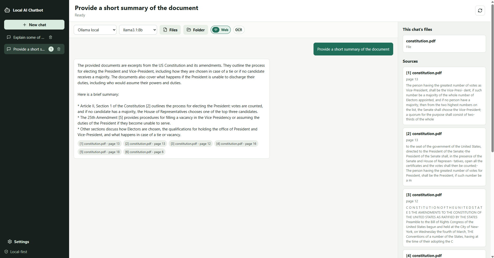

# Local AI Chatbot

Local AI Chatbot is a Windows-first desktop application for chatting with your own files using local AI models. It lets users import individual documents or entire folders, indexes their contents locally, and answers questions with citations back to the source material.

The app is built for privacy-first document assistance. Files, extracted text, embeddings, chats, settings, and diagnostics stay on the user's machine by default. Cloud AI providers and web search are optional and explicit.



## Features

- Local document chat with cited answers.
- Multiple chat sessions with chat-specific sources and saved history.
- Individual file import and recursive folder import.
- Supported file types: PDF, DOCX, TXT, Markdown, CSV, XLSX, PPTX, HTML, and HTM.
- Per-chat attachments panel showing file names or folder names with indexed file counts.
- Local Ollama model support with model status and model pull controls.
- Recommended local model list for common consumer PCs.
- Local retrieval pipeline with chunking, metadata preservation, embeddings, and vector search.
- Optional no-key DuckDuckGo Lite web search toggle.
- Optional OCR flag for scan-heavy imports.
- Bring-your-own-key provider setup for OpenAI, Anthropic Claude, Google Gemini, and xAI Grok.
- Windows installer build using Tauri NSIS.
- Backend diagnostics for app version, backend status, Ollama status, model availability, import events, and storage paths.

## Why This Exists

Many people need AI help with private information: notes, contracts, school material, receipts, manuals, research, and business documents. Sending all of that to a hosted chatbot is not always acceptable.

Local AI Chatbot was built to make private document search and AI-assisted analysis practical on a personal Windows machine. The goal is to give users:

- Privacy: local files remain on the device unless the user explicitly chooses a cloud provider or web search.
- Control: users choose their local Ollama model or bring their own cloud API keys.
- Transparency: answers include citations to documents and web results when available.
- Persistence: chats, sources, and history are saved locally.
- Flexibility: users can import one file, multiple files, or full recursive folders.

## How It Works

At a high level, Local AI Chatbot has three parts:

1. A Tauri desktop shell starts the application and launches a packaged Python backend sidecar.
2. A React/TypeScript frontend provides the chat, source, model, provider, and settings UI.
3. A FastAPI backend extracts document text, chunks it, stores metadata and chat history in SQLite, performs local vector search, and sends grounded prompts to the selected model provider.

When a user imports files, the backend reads supported document types, splits extracted text into chunks, generates local embeddings, and stores those chunks. When the user asks a question, the backend searches only the active chat's indexed sources, builds a context-aware prompt, and asks the selected model to answer with citations.

## Architecture

```text
Local AI Chatbot
├─ Tauri v2 desktop app
│  ├─ Hosts the WebView UI
│  ├─ Opens native file/folder pickers
│  └─ Starts the Python backend sidecar
│
├─ React + TypeScript frontend
│  ├─ Chat workspace
│  ├─ Per-chat file/folder attachments
│  ├─ Source and citation panel
│  ├─ Local model controls
│  ├─ Cloud provider key settings
│  └─ Diagnostics/settings UI
│
└─ Python FastAPI backend
   ├─ Document ingestion
   ├─ Text extraction
   ├─ Chunking and metadata preservation
   ├─ SQLite persistence
   ├─ Local vector search
   ├─ Ollama integration
   ├─ Cloud provider adapters
   └─ Optional DuckDuckGo Lite web search
```

### Key Design Decisions

- Windows-first desktop packaging: Tauri provides a professional desktop app and installer while keeping the frontend modern and maintainable.
- Python sidecar backend: Python has strong document parsing, API, and AI ecosystem support, and can be packaged into a sidecar executable.
- Local-first defaults: the app does not require a hosted AI service for normal local document workflows.
- Per-session backend token: the Tauri app launches the backend with a random localhost port and token so browser pages cannot call the backend freely.
- SQLite persistence: settings, chats, messages, documents, chunks, attachments, import events, and provider references are stored locally.
- Chat-scoped sources: imported files and folders belong to the active chat, preventing sources from leaking into unrelated conversations.
- Ollama for local models: users can run free local models and add additional models from Settings.
- BYO cloud keys: paid providers are available only when the user supplies their own key.

## Project Structure

```text
.
├─ README.md
├─ pyproject.toml
├─ docs/
│  ├─ PRODUCTION.md
│  └─ GITHUB_PUBLISHING.md
├─ scripts/
│  ├─ check_prereqs.ps1
│  ├─ dev_backend.ps1
│  ├─ test_backend.ps1
│  ├─ build_backend.ps1
│  ├─ build_windows.ps1
│  └─ env.ps1
├─ backend/
│  ├─ run_backend.py
│  └─ local_chatbot/
│     ├─ app.py
│     ├─ cli.py
│     ├─ db.py
│     ├─ ingestion.py
│     ├─ chunking.py
│     ├─ embeddings.py
│     ├─ vector_store.py
│     ├─ rag.py
│     ├─ ollama.py
│     ├─ providers.py
│     ├─ web_search.py
│     ├─ secrets_store.py
│     ├─ security.py
│     ├─ paths.py
│     ├─ logging_config.py
│     └─ tests/
├─ frontend/
│  ├─ index.html
│  ├─ package.json
│  ├─ vite.config.ts
│  ├─ tsconfig.json
│  └─ src/
│     ├─ App.tsx
│     ├─ api.ts
│     ├─ main.tsx
│     ├─ styles.css
│     └─ types.ts
└─ src-tauri/
   ├─ tauri.conf.json
   ├─ Cargo.toml
   ├─ build.rs
   ├─ capabilities/
   ├─ icons/
   ├─ binaries/
   └─ src/
      ├─ lib.rs
      └─ main.rs
```

### Important Backend Files

- `backend/local_chatbot/app.py`: FastAPI routes for diagnostics, chat, import, providers, attachments, and model management.
- `backend/local_chatbot/rag.py`: retrieval-augmented generation workflow.
- `backend/local_chatbot/ingestion.py`: file discovery and document text extraction.
- `backend/local_chatbot/chunking.py`: document chunk creation with metadata.
- `backend/local_chatbot/embeddings.py`: local embedding model loading with hashing fallback.
- `backend/local_chatbot/vector_store.py`: SQLite-backed vector search.
- `backend/local_chatbot/db.py`: SQLite schema and persistence logic.
- `backend/local_chatbot/ollama.py`: Ollama status, generation, and model pull integration.
- `backend/local_chatbot/providers.py`: cloud provider adapters.
- `backend/local_chatbot/web_search.py`: optional DuckDuckGo Lite web search.
- `backend/local_chatbot/secrets_store.py`: API key storage through the OS credential store.
- `backend/local_chatbot/security.py`: local API token middleware.

### Important Frontend Files

- `frontend/src/App.tsx`: main application UI and state management.
- `frontend/src/api.ts`: backend sidecar startup and authenticated API calls.
- `frontend/src/styles.css`: application layout and visual design.
- `frontend/src/types.ts`: shared frontend API types.

### Important Tauri Files

- `src-tauri/tauri.conf.json`: app metadata, window settings, build configuration, bundle settings, and sidecar configuration.
- `src-tauri/capabilities/default.json`: Tauri permissions for dialog and backend sidecar spawning.
- `src-tauri/src/lib.rs`: Tauri app setup and plugin registration.
- `src-tauri/binaries/`: generated backend sidecar output location.

## Requirements

- Windows 10 or Windows 11.
- Python 3.12 or newer.
- Node.js LTS and npm.
- Rust/Cargo with the MSVC toolchain.
- Ollama for local AI model generation.

Recommended local model:

```powershell
ollama pull llama3.1:8b
```

The app also exposes recommended local models in Settings and can pull additional Ollama models from the UI.

## Local Development Setup

Clone the repository:

```powershell
git clone https://github.com/sxm209/Local_AI_Chatbot.git
cd local-ai-chatbot
```

Create and install the Python backend environment:

```powershell
python -m venv .venv
.\.venv\Scripts\python -m pip install --upgrade pip
.\.venv\Scripts\python -m pip install -e ".[dev]"
```

Install frontend dependencies:

```powershell
cd frontend
npm install
cd ..
```

Check required tools:

```powershell
.\scripts\check_prereqs.ps1
```

Run backend tests:

```powershell
.\.venv\Scripts\python -m pytest
.\.venv\Scripts\python -m ruff check backend
```

Build the frontend:

```powershell
cd frontend
npm run build
cd ..
```

## Running During Development

Start the backend directly:

```powershell
.\scripts\dev_backend.ps1
```

The backend prints a JSON `ready` line containing the local host, port, and session token.

For full desktop development, build the backend sidecar first:

```powershell
.\scripts\build_backend.ps1
```

Then run Tauri development mode:

```powershell
cd src-tauri
cargo tauri dev
cd ..
```

## Production Build

Build the packaged Python backend sidecar:

```powershell
.\scripts\build_backend.ps1
```

Build the Windows desktop app and NSIS installer:

```powershell
.\scripts\build_windows.ps1
```

Expected production outputs:

```text
cargo-target/release/local-chatbot.exe
cargo-target/release/bundle/nsis/Local AI Chatbot_0.1.0_x64-setup.exe
```

The release executable filename is currently `local-chatbot.exe`; the visible product/window/installer name is `Local AI Chatbot`.

## Usage

1. Open Local AI Chatbot.
2. Confirm Ollama is running in Settings.
3. Choose or add a local model.
4. Create a new chat.
5. Attach files or select a folder.
6. Ask questions about the active chat's sources.
7. Review citations in the message and source panel.
8. Enable web search only when you want the answer to include web results.
9. Add cloud provider keys only if you want to use paid hosted models.

Example workflows:

- Import a folder of project notes and ask for a summary with source citations.
- Attach a PDF manual and ask where a specific configuration is explained.
- Add spreadsheets or CSV files and ask for key rows or comparisons.
- Use a local Ollama model for private files, then switch to a cloud provider only when needed.

## Privacy And Security

- Local documents are stored and indexed under the user's Windows app data directory.
- The backend binds to localhost.
- API calls require a per-session token from the Tauri-launched sidecar.
- Raw document text is not written to logs by default.
- Cloud providers are disabled until the user adds a key.
- Cloud providers may receive prompt and retrieved context snippets only when selected.
- Web search is explicit per chat and uses a no-key DuckDuckGo Lite path.
- Provider API keys are stored through the OS credential store via `keyring`.

Note: for backward compatibility, the backend app data folder currently uses the internal name `Local_Chatbot`.

## Testing

Run all backend tests:

```powershell
.\.venv\Scripts\python -m pytest
```

Run backend lint:

```powershell
.\.venv\Scripts\python -m ruff check backend
```

Run frontend production build:

```powershell
cd frontend
npm run build
cd ..
```

## GitHub Publishing

See [docs/GITHUB_PUBLISHING.md](docs/GITHUB_PUBLISHING.md) for a complete step-by-step GitHub upload and repository organization guide.

## Production Notes

See [docs/PRODUCTION.md](docs/PRODUCTION.md) for packaging, installer, and release-readiness notes.

## License

MIT license
